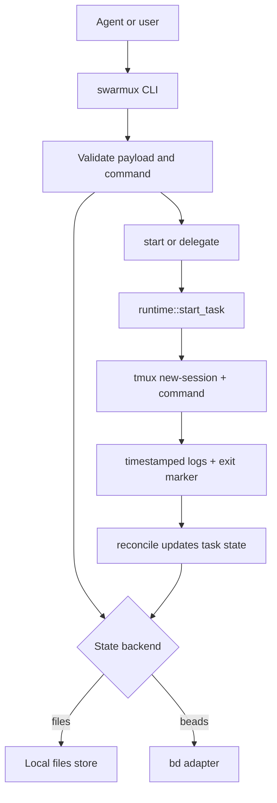

# swarmux

Agent-first tmux swarm orchestration for local coding tasks.

`swarmux` gives coding agents a narrow control plane for submitting, starting, inspecting, steering, reconciling, and pruning local work. Humans keep tmux visibility; agents get machine-readable commands and strict input validation.

## Requirements

- `tmux`
- `git`
- a POSIX shell at `/bin/sh`
- optional: `bd` when `SWARMUX_BACKEND=beads`

## Install

Primary release artifacts are GitHub release tarballs.
Current supported platforms:

- `x86_64-unknown-linux-gnu`
- `aarch64-apple-darwin`

Install the latest tagged release into `~/.local/bin`, or any other directory on `PATH`:

```bash
TARGET=x86_64-unknown-linux-gnu # or aarch64-apple-darwin
curl -L "https://github.com/ghillb/swarmux/releases/latest/download/swarmux-${TARGET}.tar.xz" \
  | tar -xJf - -C /tmp
install -m 0755 "/tmp/swarmux" ~/.local/bin/swarmux
```

Install from source only if you are developing locally:

```bash
cargo install --path .
```

If you use the optional beads backend, ensure `bd` is installed and on `PATH`.

To expose the official `swarmux` skill to agents that load global skills from
`~/.agents/skills`, download it from GitHub and place it there:

```bash
mkdir -p ~/.agents/skills/swarmux
curl -L \
  "https://github.com/ghillb/swarmux/raw/main/.agents/skills/swarmux/SKILL.md" \
  -o ~/.agents/skills/swarmux/SKILL.md
```

If your agent runtime uses a different global skills path, place the same
directory there instead.

## Quick start

```bash
swarmux doctor
swarmux init
swarmux schema
swarmux submit --json '{
  "title": "hello",
  "repo_ref": "demo",
  "repo_root": "/path/to/repo",
  "mode": "manual",
  "worktree": "/path/to/repo",
  "session": "swarmux-demo",
  "command": ["codex","exec","-m","gpt-5.3-codex","echo hi from task"]
}'
swarmux list
swarmux panes
swarmux overview --once
swarmux overview --once --scope all
swarmux overview --tui
```

Structured commands emit JSON by default. Use `--output text` when you want the pretty-printed human view. TUI commands ignore `--output`.

`overview --tui` opens a two-tab dashboard: `Tasks` and `Stats`.
Inside `Tasks`, press `f` to cycle `active -> terminal -> all`.

tmux-friendly dispatch without JSON quoting:

```bash
swarmux dispatch \
  --title "hello" \
  --repo-ref demo \
  --repo-root /path/to/repo \
  -- codex exec -m gpt-5.3-codex "echo hi from task"
```

Connected dispatch from the current tmux pane:

```bash
swarmux dispatch \
  --connected \
  --mirrored \
  --prompt "fix tests" \
  -- codex exec
```

Configured default connected command:

```toml
# ~/.config/swarmux/config.toml
[connected]
runtime = "mirrored"
command = ["codex", "exec"]
```

```bash
swarmux dispatch --connected --human --prompt "fix tests"
```

Add `--human` when you want a compact task summary instead of the JSON response.

Actual TUI runtime in a task session:

```bash
swarmux submit --json '{
  "title": "tui task",
  "repo_ref": "demo",
  "repo_root": "/path/to/repo",
  "mode": "manual",
  "runtime": "tui",
  "worktree": "/path/to/repo",
  "session": "swarmux-demo-tui",
  "command": ["my-tui-agent", "fix tests"]
}'
swarmux start <id>
swarmux attach <id>
```

Configured named agent runners:

```toml
# ~/.config/swarmux/config.toml
[connected]
agent = "codex"
runtime = "mirrored"

[agents.codex]
command = ["codex", "exec"]

[agents.claude]
command = ["claude", "-p"]
```

```bash
swarmux dispatch --connected --agent claude --prompt "summarize diff"
```

tmux binding for connected dispatch:

```tmux
bind-key D command-prompt -p "Task" "run-shell 'swarmux dispatch --connected --pane-id \"#{pane_id}\" --prompt \"%1\"'"
```

`headless` remains the default runtime when no override is configured.
`mirrored` keeps a non-TUI CLI runner visible in the task session and mirrors pane output into logs.
`tui` runs a full-screen interactive program in its own tmux session, still detached from `start`/`delegate` so agents get a clean JSON response and operators choose when to `attach`.

Connected dispatch still appends `--prompt` as the trailing command argument for every runtime. Use `tui` there only with commands that naturally accept that trailing prompt input.

`swarmux overview --tui` is the interactive tasks dashboard.

`swarmux panes switch` keeps the native tmux tree popup path. `swarmux panes switch --tui --pane-id "#{pane_id}"` opens the full-screen custom switcher. `swarmux panes switch --tui-sidebar --pane-id "#{pane_id}"` renders the sidebar TUI. `swarmux panes switch --launch-sidebar --pane-id "#{pane_id}"` is the tmux-side launcher that opens the split pane for that sidebar.

Example tmux binds:

```tmux
bind -n C-M-Space display-popup -B -w 100% -h 100% -E "sh -lc 'swarmux panes switch --tui --pane-id \"#{pane_id}\"'"
bind -n C-M-u run-shell -b "swarmux panes switch --launch-sidebar --pane-id \"#{pane_id}\""
```

The sidebar closes on `q` or `Esc` and the launched split pane is cleaned up automatically.

Canonical state configuration can also live in `config.toml`:

```toml
# ~/.config/swarmux/config.toml
home = "/home/you/.local/state/swarmux"
backend = "files" # or "beads"

[tmux]
session_ignore = ["ft-*", "git-*", "nvim-*", "bv-*"]
```

`tmux.session_ignore` is optional. Leave it unset to show all sessions; set it to match your tmux workspace filters if you want the pane switcher to hide those sessions too.

The custom switchers also have per-mode current-session filters:

- `[ui].pane_switcher_current_session_only` for `--tui`
- `[ui].pane_switcher_sidebar_current_session_only` for `--tui-sidebar`

Press `s` inside either custom switcher to toggle the current-session filter at runtime.

The switcher row style is also configurable:

- `[ui].pane_switcher_highlight = "underline" | "solid"`
- `[ui].pane_switcher_show_arrow = true | false`

Environment variables still override config values:

- `SWARMUX_HOME`
- `SWARMUX_BACKEND`
- `SWARMUX_CONFIG_HOME`

## How it works

`swarmux` stores task state in either `files` (default) or `beads` (`SWARMUX_BACKEND=beads`), but runtime execution is always tmux-driven and command-agnostic. The `command` array from `submit` is executed as-is inside a tmux session.



For task-scoped waiting, use `swarmux wait <id...>` to block until one watched task reaches a target state. Use `swarmux watch <id...>` for a foreground task-scoped poll stream with log previews. Keep `swarmux notify --tmux` for global terminal notifications via `tmux display-message`.

Task-scoped waiting:

```bash
swarmux wait <id> --states succeeded,failed --timeout-ms 600000
swarmux watch <id> --states waiting_input,succeeded,failed,canceled --lines 40
```

PR or external linkage can be updated after creation:

```bash
swarmux set-ref <id> "https://github.com/owner/repo/pull/123"
```

`watch`/`notify` include compact task output excerpts:

```text
swarmux 4rh succeeded what is the time currently ...current time is 23:14:05
```

```text
2026-03-14T10:22:31Z spawned swx-swarmux-4rh
2026-03-14T10:22:35Z current time is 23:14:05
```
