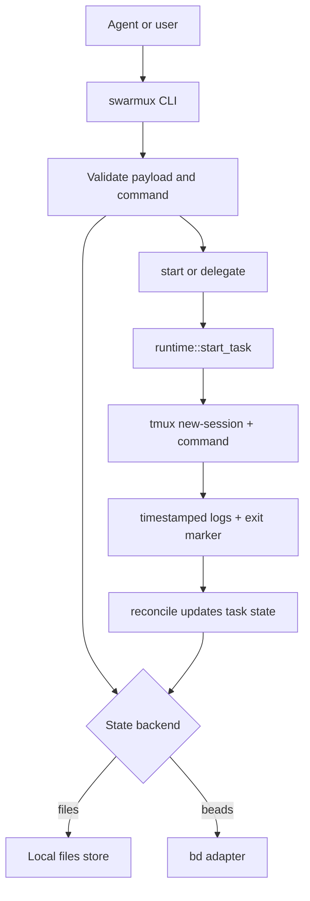

# swarmux

Agent-native Rust CLI for tmux-based orchestration of local coding tasks.

`swarmux` gives coding agents a narrow control plane for submitting, starting, inspecting, steering, reconciling, and pruning local work. Humans keep direct access and inspectability. Agents get machine-readable commands and strict input validation.

## Requirements

- `tmux`
- `tmux` 3.7 or newer
- `git`
- a POSIX shell at `/bin/sh`
- optional: `bd` when `SWARMUX_BACKEND=beads`

## Getting started

Install, tmux setup, and first-task flow live in [Get Started](docs/getting-started.md).

## Quick start

```bash
swarmux doctor
swarmux init
swarmux schema
swarmux submit --json '{
  "title": "hello",
  "repo_ref": "demo",
  "repo_root": "/path/to/repo",
  "mode": "manual",
  "worktree": "/path/to/repo",
  "session": "swarmux-demo",
  "command": ["codex","exec","-m","gpt-5.3-codex","echo hi from task"]
}'
swarmux list
swarmux panes
swarmux panes jump --index 1
swarmux overview --once
swarmux overview --once --scope all
swarmux overview --tui
```

Structured commands emit JSON by default. Use `--output text` when you want the pretty-printed human view. TUI commands ignore `--output`.

The tmux plugin at [`swarmux.tmux`](./swarmux.tmux) is bindings-only. Install the `swarmux` binary first, then let TPM source the bindings from this repo.

TPM is the canonical tmux setup path. The plugin exposes tmux-managed bindings through:

- `@swarmux-dispatch-key`
- `@swarmux-pane-switch-key`
- `@swarmux-sidebar-key`
- `@swarmux-overview-key`
- `@swarmux-index-keys`

`overview --tui` opens a two-tab dashboard: `Tasks` and `Stats`.
Inside `Tasks`, press `f` to cycle `active -> terminal -> all`.

## Screenshots


tmux-friendly dispatch without JSON quoting:

```bash
swarmux dispatch \
  --title "hello" \
  --repo-ref demo \
  --repo-root /path/to/repo \
  -- codex exec -m gpt-5.3-codex "echo hi from task"
```

Connected dispatch from the current tmux pane:

```bash
swarmux dispatch \
  --connected \
  --mirrored \
  --prompt "fix tests" \
  -- codex exec
```

Configured default connected command:

```toml
# ~/.config/swarmux/config.toml
[connected]
runtime = "mirrored"
command = ["codex", "exec"]
```

```bash
swarmux dispatch --connected --human --prompt "fix tests"
```

Add `--human` when you want a compact task summary instead of the JSON response.

Actual TUI runtime in a task session:

```bash
swarmux submit --json '{
  "title": "tui task",
  "repo_ref": "demo",
  "repo_root": "/path/to/repo",
  "mode": "manual",
  "runtime": "tui",
  "worktree": "/path/to/repo",
  "session": "swarmux-demo-tui",
  "command": ["my-tui-agent", "fix tests"]
}'
swarmux start <id>
swarmux attach <id>
```

Configured named agent runners:

```toml
# ~/.config/swarmux/config.toml
[connected]
agent = "codex"
runtime = "mirrored"

[agents.codex]
command = ["codex", "exec"]

[agents.claude]
command = ["claude", "-p"]
```

```bash
swarmux dispatch --connected --agent claude --prompt "summarize diff"
```

`headless` remains the default runtime when no override is configured.
`mirrored` keeps a non-TUI CLI runner visible in the task session and mirrors pane output into logs.
`tui` runs a full-screen interactive program in its own tmux session, still detached from `start`/`delegate` so agents get a clean JSON response and operators choose when to `attach`.

Connected dispatch still appends `--prompt` as the trailing command argument for every runtime. Use `tui` there only with commands that naturally accept that trailing prompt input.

Setup details, tmux binds, and pane-switcher configuration live in [Get Started](docs/getting-started.md).

## How it works

`swarmux` stores task state in either `files` (default) or `beads` (`SWARMUX_BACKEND=beads`), but runtime execution is always tmux-driven and command-agnostic. The `command` array from `submit` is executed as-is inside a tmux session.



For task-scoped waiting, use `swarmux wait <id...>` to block until one watched task reaches a target state. Use `swarmux watch <id...>` for a foreground task-scoped poll stream with log previews. Keep `swarmux notify --tmux` for global terminal notifications via `tmux display-message`.

Task-scoped waiting:

```bash
swarmux wait <id> --states succeeded,failed --timeout-ms 600000
swarmux watch <id> --states waiting_input,succeeded,failed,canceled --lines 40
```

PR or external linkage can be updated after creation:

```bash
swarmux set-ref <id> "https://github.com/owner/repo/pull/123"
```

`watch`/`notify` include compact task output excerpts:

```text
swarmux 4rh succeeded what is the time currently ...current time is 23:14:05
```

```text
2026-03-14T10:22:31Z spawned swx-swarmux-4rh
2026-03-14T10:22:35Z current time is 23:14:05
```
